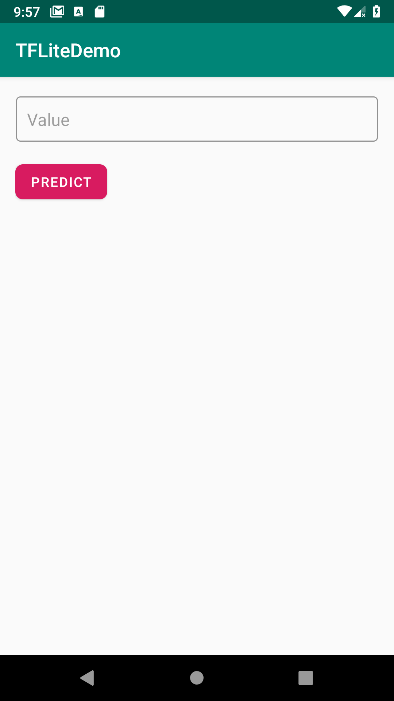
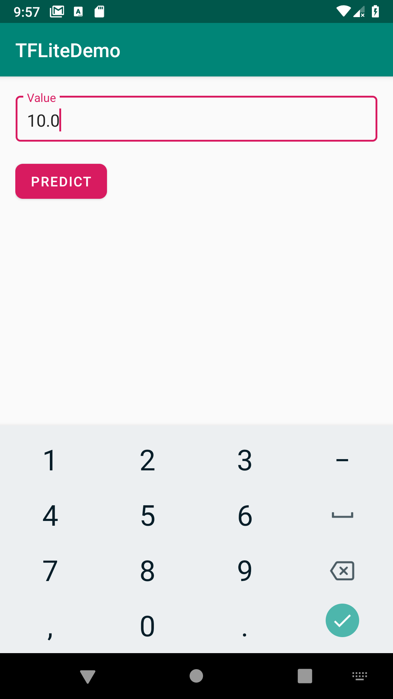
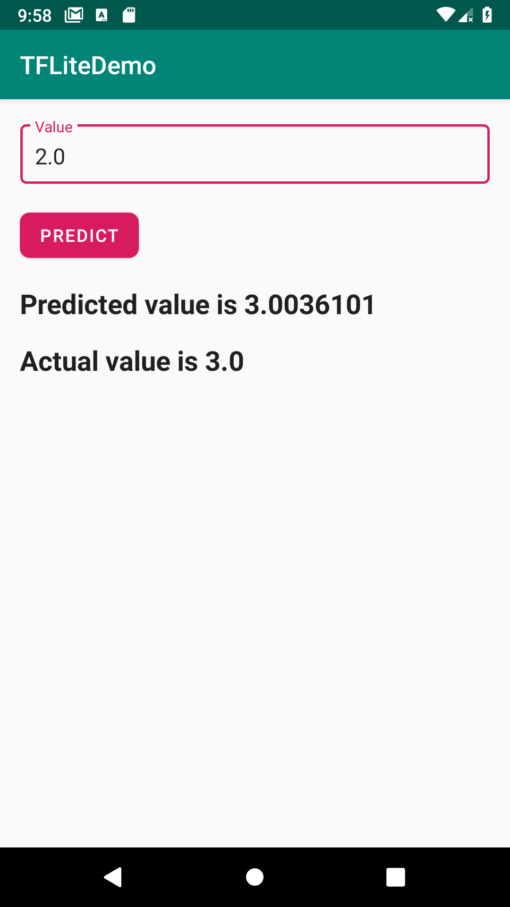

<h1>Android-TFLite-Demo</h1>

This repository demonstrates the lifecycle of a deep learning project i.e from idea to deployment.

<h2>Tools used</h2>
<ul>
  <li>Google Colab</li>
  <li>Keras (with Tensorflow backend)</li>
  <li>Android Studio</li>
</ul>

<h2>Prerequisites</h2>
<ul>
  <li>Python programming</li>
  <li>Android development</li>
  <li>Building neural nets using Keras</li>
</ul>

<h2>Steps</h2>
<ol>
  <li>Building and training the model using Keras</li>
  <li>Converting the tf.keras model to .tflite model (Tensorflow Lite)</li>
  <li>Creating an Android Studio Project</li>
  <li>Storing the .tflite model in the 'assets' folder of the app project</li>
  <li>Fetching the model using Tensorflow Lite Android library</li>
  <li>Passing the inputs to the model</li>
  <li>Getting the prediction value and displaying it on the screen</li>
</ol>

<b>Note : The dataset we have provided is of y = 2x - 1 relationship.</b>

<h2>Screenshots</h2>

This is the overall look of the app

Let's try to input a value

Entering 10.0 as value, we should get expected output to be nearer to (2 * <b>10.0</b> - 1 = 19.0)

Entering 2.0 as value, we should get expected output to be nearer to (2 * <b>2.0</b> - 1 = 3.0)

